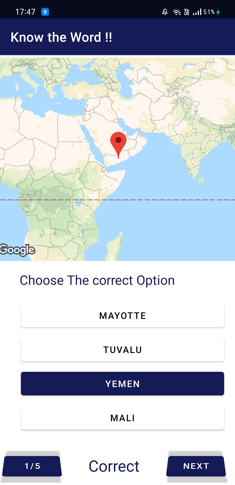
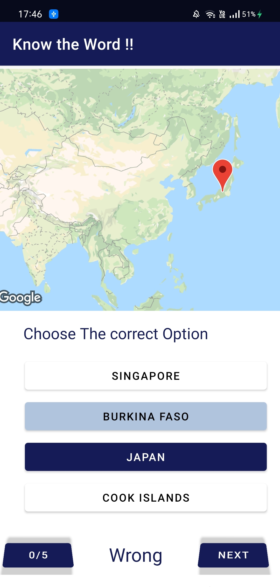

# Google-Map-Quiz-App

A quiz app to guess countries name using marker on maps is created with help of Google Map APIs . Data and location(LatLang) are fetched using GeoCoder , Locale Classes . Styling is used on google maps to hide the locationTags.
 

  
<ul>
  <b>These 4 pictures shows following :</b>
  <li> First enter number of Questions you want to have in quiz.
  <li> A map will appear , containing a marker , you have to guess the name of the location out of 4 options
  <li> If you answer is correct you will get +1 points , otherwise not .
 </ul>
   
